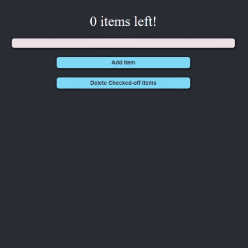

# React To-Do List

## Licensing

## Table of Contents
* [Description](#description)
* [Screenshots](#screenshots)
* [Technologies](#technologies)
* [Questions](#questions)

## Description
This is a simple To-Do List built with React.js. 

## Screenshots
Empty To-Do List

Full To-Do List

## Technologies
This application is written with React (as well as all of the dependencies found in the package.json files).

## Questions
Reach out to me using my [Github account](https://github.com/Ericcrain77) or my [email](ericcrain77@gmail.com).